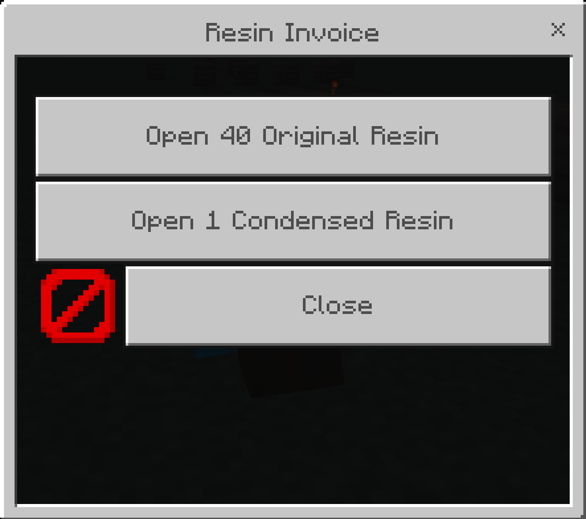

# 🌙 ResinAPI


ResinAPI is an economy plugin for [PocketMine-MP](https://github.com/pmmp/PocketMine-MP) used to handle payment transactions when defeating bosses or obtaining domain artifacts like Genshin Impact game

## Table of Contents

- [Commands](#commands)
- [Configuration](#configuration)
- [For Developers](#for_developers)
  - [Manage Player's Resin](#manage_resin)
  - [Send Payment to Player](#send_payment)
- [Contributing](#contributing)
- [License](#license)

## Commands <a name="commands"></a>

| Name      | Description | Permission | Usage         |
|-----------|-------------|------------|---------------|
| /resin help| Shows all available commands | `resinapi.command.help` | `/resin help` |
| /resin list| Lists all resin types | `resinapi.command.list` | `/resin list` |
| /resin check| Checks your or another player's resin balance | `resinapi.command.check` | `/resin check Steve` |
| /resin give| Gives resin to specified player | `resinapi.command.give` | `/resin give Alex original_resin 50` |
| /resin set| Sets player's resin amount | `resinapi.command.set` | `/resin set Steve fragile_resin 20` |
| /resin take| Takes resin from specified player | `resinapi.command.take` | `/resin take Alex condensed_resin 30` |


## Configuration <a name="configuration"></a>

ResinAPI can be configured via `config.yml`. Here's a complete reference:
```yaml
# default-language: Set default language
# language list: en, id
default-lang: en-US

# provider: Set user-provider type of database
# provider list: yaml, json, sqlite, mysql
provider: yaml

# check-update: When set to true, update notification will be displayed when server started
check-update: true

# default-resin: Set the default money when player first joined the server.
default-resin:
  "Original Resin": 200
  "Fragile Resin": 0
  "Condensed Resin": 0

# max-resin: Set maximum resin that player can have
max-resin:
  "Original Resin": 200
  "Fragile Resin": 200
  "Condensed Resin": 200

# interval-to-update: Set default minute when updating resin
# for example resin will update every 8 minutes
interval-to-update: 8

database:
  mysql:
    host: localhost
    username: username
    password: password
    schema: db_name
    port: 3306
```

## For Developers <a name="for_developers"></a>

### Manage Player's Resin <a name="manage_resin"></a>
All of method to Manage Player's Resin `addResin()`, `reduceResin()` and `setResin()`

```php
use pixelwhiz\resinapi\ResinAPI;

$resinApi = ResinAPI::getInstance(); ## ResinAPI Plugin Instance

$resinApi->addResin(Player|string $player, int $amount, string $resinType); ## Add Player's Resin
$resinApi->reduceResin(Player|string $player, int $amount, string $resinType); ## Reduce Player's Resin
$resinApi->setResin(Player|string $player, int $amount, string $resinType); ## Set Player's Resin
```

ResinAPI have 3 of ResinType same like Genshin Impact: `ORIGINAL_RESIN`, `CONDENSED_RESIN` and `FRAGILE_RESIN`

Example: `ORIGINAL_RESIN`
```php
<?php

namespace YourPluginName;

use pixelwhiz\resinapi\ResinAPI;
use pixelwhiz\resinapi\ResinTypes;

class Main extends PluginBase {
    
    public function execute(Player $player){  
        $resin = ResinTypes::ORIGINAL_RESIN;
        $amount = 20;
        
        
        $resinApi = ResinAPI::getInstance();
        
        # if you want use callback
        # $result = $resinApi->setResin($player, 20, $originalResin);
        # if ($result === ResinAPI::RET_SUCCESS) {
        #    $player->sendMessage("Player $player's resin was set to $amount");
        # }
        
        $resinApi->setResin($player, 20, $resin);
        $player->sendMessage("Player ".$player->getName()."'s $resin was set to $amount");
        
        // OUTPUT: Player steve's Original Resin was set to 20
    }
    
}
```

### Send Payment to Player <a name="send_payment"></a>


You can use an example transaction in ResinAPI same as Genshin Impact

#### Basic Usage
```php
use pixelwhiz\resinapi\ResinAPI;

$resinApi = ResinAPI::getInstance();
$resinAPI->sendPayment($player, "Resin Payment", function(Player $player, string $resinType, int $amount) {
    $player->sendMessage("Successfully paid $amount $resinType!");
});
```

#### Practical Example

The code below uses `PlayerInteractEvent` but if you want implement like Genshin Impact you must create an Entity object, You can use my [Herobrine](https://github.com/pixelwhiz/Herobrine) plugin for example.
```php
use pocketmine\event\PlayerInteractEvent;
use pocketmine\player\Player;
use pocketmine\item\VanillaItems;

use pixelwhiz\resinapi\ResinAPI;

public function onChestOpen(PlayerInteractEvent $event) {
    $player = $event->getPlayer();
    
    $resinApi = ResinAPI::getInstance();    
    $resinAPI->sendPayment($player, "Resin Payment", function(Player $player, string $type, int $amount) {
        $items = [
            VanillaItems::STONE(),
            VanillaItems::DIAMOND_SWORD(),
            VanillaItems::IRON_SWORD(),
        ];
        $item = $items[array_rand($items)];
        $player->getInventory()->addItem($item);
        $player->sendMessage("Successfully paid $amount $resinType!");
    });
}
```

## Contributing <a name="contributing"></a>

All kinds of contribution are welcome
- Send feedbacks.
- Submit bug reports.
- Write / Edit the documents.
- Fix bugs or add new features.

and if you found bug or have any issues please report them [here](https://github.com/pixelwhiz/ResinAPI/issues/new)

## License <a name="license"></a>

This project is licensed under LGPL-3.0. Please see [LICENSE](LICENSE) file for details.